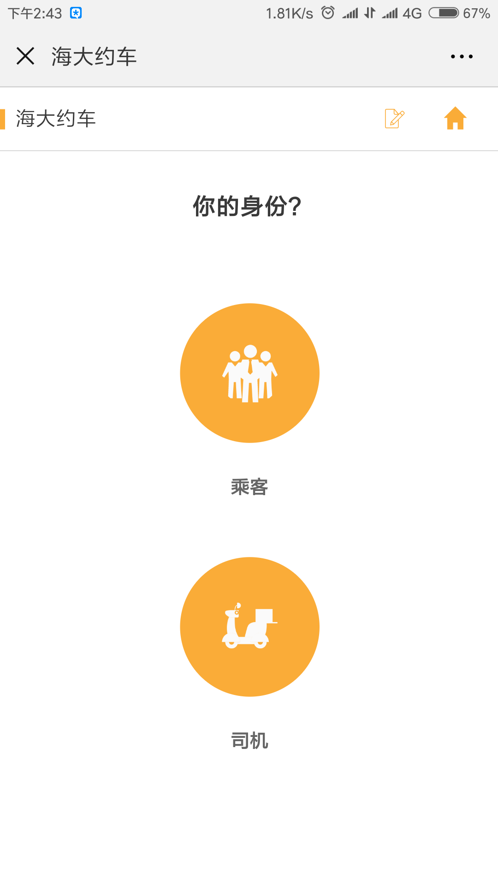
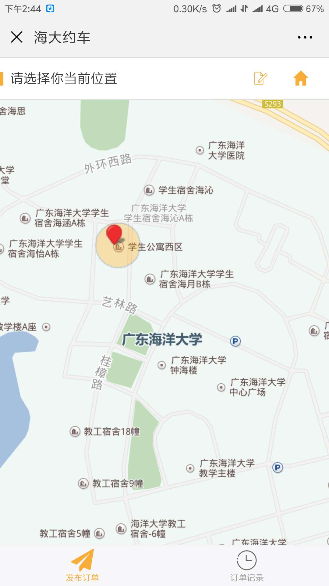
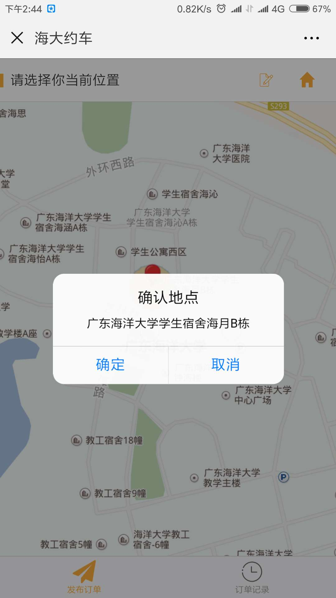
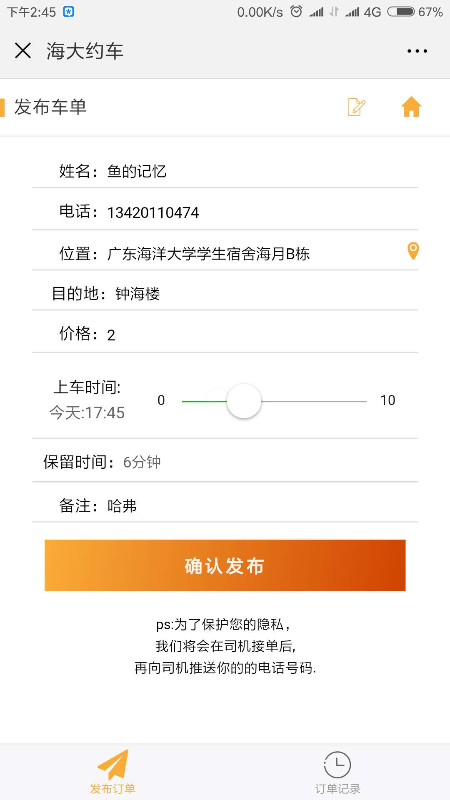
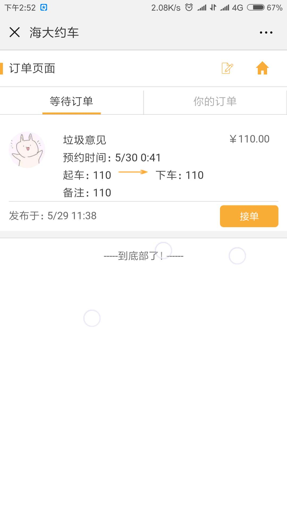
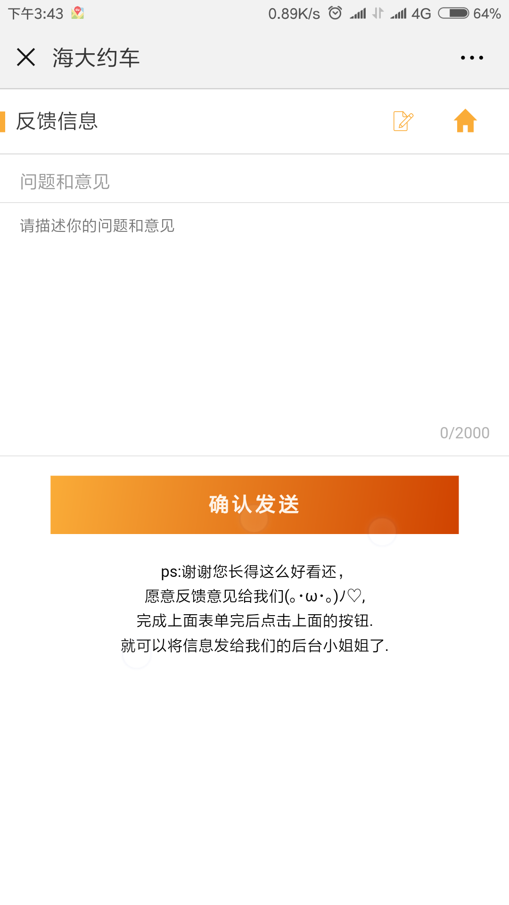

# datecar(海大约车)

####  预览地址 [海大约车](http://xqddin.cn/datecar/)（链接已失效，暂时服务器在跑其他项目），一元服务器配置不太高 ，需要使用微信来查看，属于微信开发项目

<div style="width:80%;text-align:center">


</div>

> 一个基于vue开发的小项目，可以通过下面的提示来部署项目

> 项目index.html里面引入了百度地图的秘钥会导致再本地无法运行，可以尝试使用自己的秘钥（*），或者删掉。

>本地部署可以参考下面部署教程

#### 技术栈

>vue2.9.3+vue-router2+es6+webpack+promise+stylus+flex布局

#### 描述

- 单页面，vue-route路由
- 组件封装，有扩展性
- icon使用的iconMoon的
- 百度地图插件大部分手机要请求定位权限，不然就是非洲几内亚湾了，难
- 参考了别人写的上拉刷新，下拉加载写了一个自己的组件，算是轮子吧，折腾了两三天
- 只有移动端，界面只是兼容新版本的手机，用wechat开发者工具在iphone5会出现样式堆叠
- 自己写的ui界面，有参考之前项目的一些样式，感觉还不算丑吧


#### 环境要求

>node(npm)+vue

#### Build Setup

``` bash
git clone git@github.com:huangyijan/datecar.git


# install dependencies
npm install

# serve with hot reload at localhost:8080
npm run dev

# build for production with minification
npm run build

# build for production and view the bundle analyzer report
npm run build --report
```

#### 功能（其实也就是页面）

- [x] 微信登陆
- [x] 表单验证
- [x] 发送订单
- [x] 订单列表
- [x] 接收订单
- [x] 用户反馈
- [x] 司机订单
- [x] 地图定位
- [x] 订单详情

部分截图

<table>
    <tr>
        <th ></th>
        <th></th>
    </tr>
    <tr>
        <th ></th>
        <th></th>
    </tr>
    <tr>
        <th ></th>
        <th></th>
    </tr>
    <tr>
        <th ></th>
        <th></th>
    </tr>
    <tr>
        <th ></th>
        <th></th>
    </tr>
</table>

> 完

